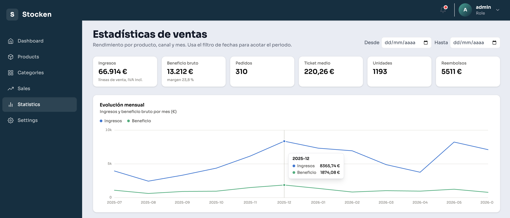
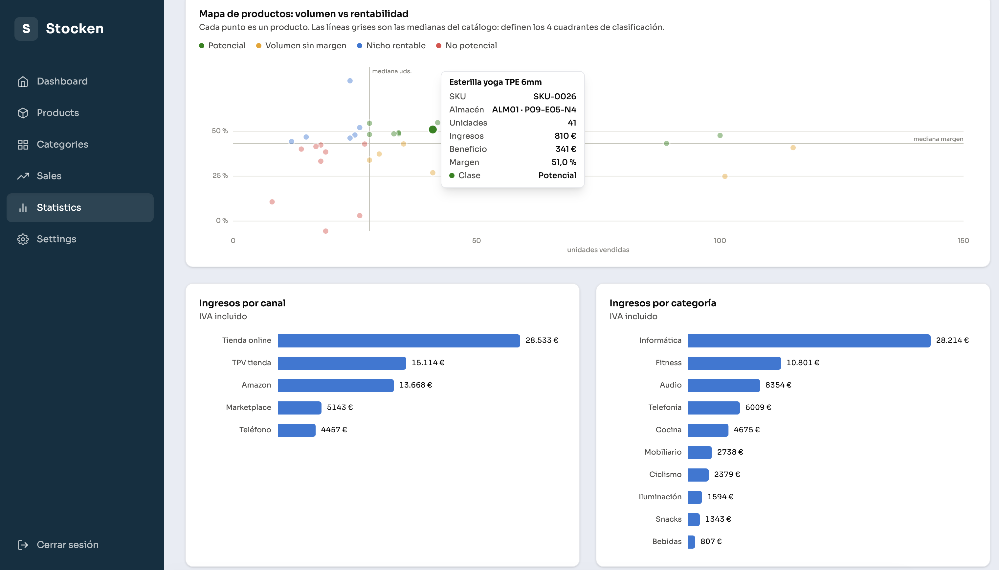
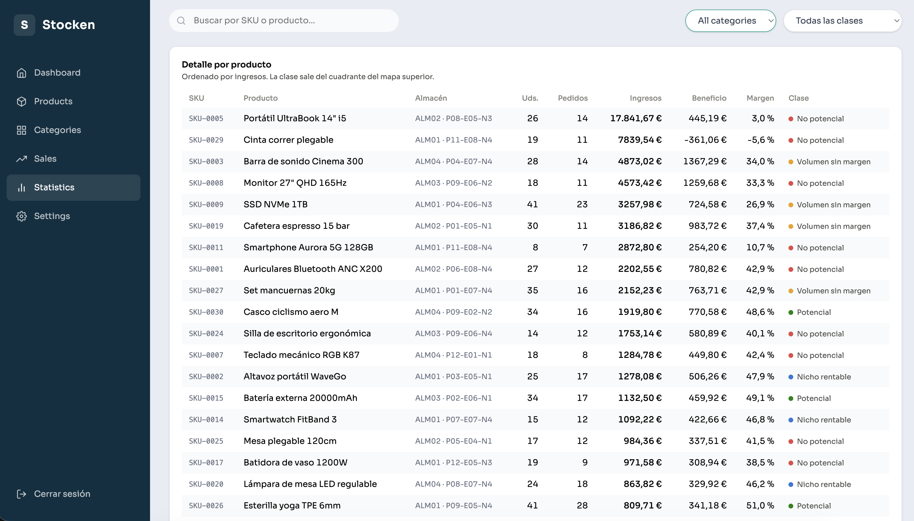

# Stocken Data

Plataforma web de gestión de inventario y análisis de ventas para pequeño comercio y e-commerce. Importa archivos CSV y XLSX de cualquier origen —cada tienda exporta con nombres de columna distintos— y los normaliza mediante un **mapeo dinámico de campos**, para poder calcular estadísticas fiables sobre datos que llegan sin estructura fija.





---

## Funcionalidades

- **Importación de CSV y XLSX** con detección de columnas y previsualización antes de guardar
- **Mapeo dinámico de campos**: el usuario asocia las columnas de su archivo con los campos del sistema; lo no mapeado se conserva igualmente
- **Gestión de inventario** multi-almacén y multi-ubicación, con stock mínimo, reservado y disponible
- **Estadísticas de ventas**: facturación, ticket medio, margen bruto, ventas por canal y por producto
- **Trazabilidad de movimientos**: cada cambio de stock queda registrado con su origen (venta, reposición, ajuste, devolución)
- **Asistente conversacional** (en desarrollo): consultas en lenguaje natural sobre las ventas
- **Autenticación de usuarios con datos aislados por cuenta**

## Arquitectura

| Servicio | Tecnología | Puerto | Función |
|---|---|---|---|
| `frontend` | React + Vite | 5173 | Interfaz de usuario |
| `backend` | Node.js | 4000 | API REST, importación y cálculo de métricas |
| `chatbot_service` | Python | 8000 | Servicio de consultas en lenguaje natural |
| `db` | PostgreSQL 17 | 5432 | Persistencia |

## Instalación

### Requisitos

- Docker y Docker compose

### Pasos

```bash
# 1. Clonar
git clone https://github.com/Jhonatan-Caro/Stocken-Data.git
cd Stocken-Data

# 2. Configurar variables de entorno
cp .env.example .env
# Edita .env con tus valores

# 3. Levantar
docker compose up --build
```

Disponible en `http://localhost:5173`. El esquema de base de datos se crea solo la primera vez desde `init.sql`.

> El servicio `chatbot_service` requiere una `OPENAI_API_KEY` válida; sin ella ese contenedor no arranca (el resto de la app funciona igualmente).

Para datos de ejemplo con los que probar la importación, tienes archivos en [`data/samples/`](data/samples). En el inventario se deben importar productos con SKU y Stock para obtener estadísticas.

### Variables de entorno

Copia `.env.example` a `.env` y rellena los valores. Las cuatro variables de contraseña de la base de datos (`POSTGRES_PASSWORD`, `DATABASE_URL`, `DB_URI`, `DB_PASSWORD`) deben tener **el mismo valor**.

## Estructura

```
├── backend/           # API REST en Node.js
├── chatbot_service/   # Servicio de consultas en Python
├── frontend/          # Cliente React + Vite
├── data/samples/      # Archivos de ejemplo para probar la importación
├── docs/              # Capturas y documentación
├── init.sql           # Esquema de base de datos
└── docker-compose.yml
```

---

## Decisiones técnicas

El reto de este proyecto no fue leer archivos CSV. Fue que **cada cliente exporta sus ventas con un formato distinto**, y aun así las estadísticas tienen que ser correctas. Estas son las decisiones que salieron de ahí:

### Columnas tipadas y JSONB conviviendo

Cada fila importada se guarda en dos sitios: los campos que el usuario mapea van a **columnas tipadas** (`total`, `quantity`, `margin`, `sold_at`), y la fila original completa se conserva en una columna **JSONB**.

La razón es que agrupar por JSONB no es fiable cuando los nombres de campo cambian con cada archivo: un `GROUP BY` sobre una clave que un cliente llama `canal` y otro `Sales Channel` no produce nada útil. Todo lo que se agrega o filtra en las estadísticas vive en columnas reales; el JSONB actúa como respaldo de la información que no se mapeó, sin perder nada de lo que el usuario subió.

### `NUMERIC` en lugar de `FLOAT` para dinero

Los importes usan `NUMERIC(12,2)`. Con coma flotante, sumar miles de líneas de venta acumula errores de redondeo y el total mostrado deja de cuadrar con la suma real. En un panel de facturación eso no es un detalle estético: invalida el dato.

### Cabeceras de pedido separadas de las líneas

Los archivos de ventas reales distinguen entre el pedido (fecha, canal, cliente, portes, total, reembolsos) y sus líneas (una por producto). El esquema refleja esa realidad con `sale_orders` y `sales`.

Sin esa separación no se pueden calcular métricas de nivel pedido —ticket medio, número de pedidos, gastos de envío—, porque quedarían repetidas en cada línea e infladas al sumarlas.

### Reimportar no duplica

La restricción `UNIQUE (user_id, order_ref)` convierte la reimportación de un mismo archivo en un UPSERT en lugar de una inserción. Subir dos veces el reporte del mes es un error de usuario habitual, y sin esta restricción duplicaría la facturación del periodo.

### Identidad de producto por SKU + almacén + ubicación

Un mismo SKU puede existir en varios almacenes con su propio stock, así que la clave de unicidad los incluye. Los campos `warehouse` y `location` usan cadena vacía en vez de `NULL` cuando no se mapean, porque en SQL dos `NULL` no se consideran iguales y la restricción de unicidad dejaría de aplicarse justo en el caso más común: el cliente que no gestiona ubicaciones.

### El agente no genera SQL, consume las consultas del dashboard

El chatbot no traduce lenguaje natural a SQL libre. Accede a las mismas consultas que generan las estadísticas del panel, expuestas como endpoints del backend sobre `stats.service.js` y replicadas en Python como funciones espejo.

Así se evitan dos problemas a la vez: el agente no puede responder cifras que no coincidan con lo que el cliente ve en su dashboard, y no tiene acceso directo a la base de datos, de modo que ninguna instrucción incrustada en la pregunta del usuario puede alcanzarla.

---

## Licencia

MIT - ver [LICENSE](LICENSE).

## 👤 Autor

**Jhonatan Caro Suárez**  
[GitHub](https://github.com/Jhonatan-Caro) · [LinkedIn](https://www.linkedin.com/in/jhonatancarosuarez/)